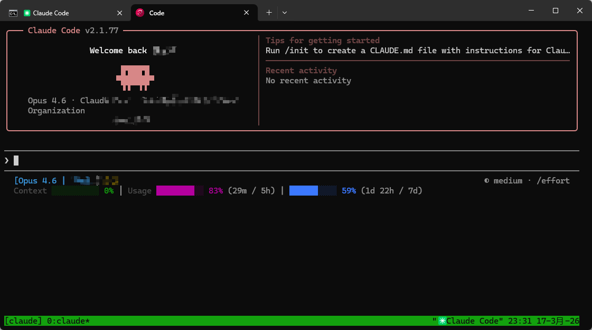

# ClaudeCode

## 实用工具

### Tmux 脚本

通过在服务器挂起一个 `Claude` 的 `Tmux` 会话让 Claude 会话永远在线，多端同显，无惧断连。

<details>
    <summary>脚本源码</summary>

```shell

- ./claude-tmux.sh install 安装后执行 cc 即可使用
- ./claude-tmux.sh uninstall 卸载
- ./claude-tmux.sh stop 关闭所有后台会话

```

```shell [./claude-tmux.sh]
#!/usr/bin/env bash
set -euo pipefail

SESSION_NAME="claude"
ALIAS_LINE="alias cc='/root/claude-tmux.sh'"

case "${1:-}" in
  install)
    if grep -qF "$ALIAS_LINE" ~/.bashrc 2>/dev/null; then
      echo "alias cc 已存在于 ~/.bashrc"
    else
      echo "$ALIAS_LINE" >> ~/.bashrc
      echo "已添加 alias cc 到 ~/.bashrc，请运行 source ~/.bashrc 或重新打开终端"
    fi
    ;;
  uninstall)
    if grep -qF "$ALIAS_LINE" ~/.bashrc 2>/dev/null; then
      grep -vF "$ALIAS_LINE" ~/.bashrc > ~/.bashrc.tmp && mv ~/.bashrc.tmp ~/.bashrc
      echo "已从 ~/.bashrc 移除 alias cc，请运行 source ~/.bashrc 或重新打开终端"
    else
      echo "未找到 alias cc"
    fi
    ;;
  stop)
    if tmux has-session -t "$SESSION_NAME" 2>/dev/null; then
      tmux kill-session -t "$SESSION_NAME"
      echo "已关闭 tmux 会话: $SESSION_NAME"
    else
      echo "没有名为 $SESSION_NAME 的 tmux 会话"
    fi
    ;;
  *)
    if tmux has-session -t "$SESSION_NAME" 2>/dev/null; then
      exec tmux attach -t "$SESSION_NAME"
    else
      exec tmux new-session -s "$SESSION_NAME" "claude"
    fi
    ;;
esac
```

</details>

### ClaudeHub [🔗](https://github.com/jarrodwatts/claude-hud)

Token焦虑~ 状态栏查看用量，最重要是能看到当前上下文脑容量


