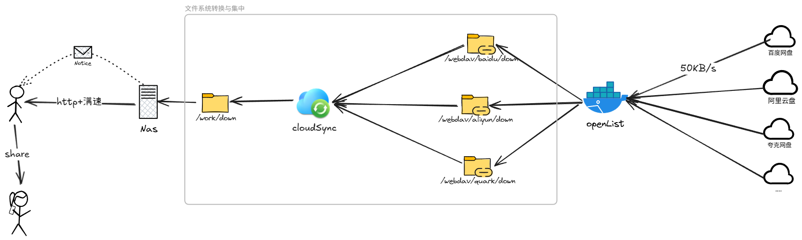

# 网盘下载

互联网资源越来越封闭， 资源都以分享的形式存在各个私有网盘中，传统的 http、Bt 等直接下载的方式越来越困难。

可以通过 `openList` 将网盘挂载为本地 `webdav`，然后通过 `CloudSync` 从 `webdav` 同步到 文件系统 打造自己网盘的 “离线下载”， 结合 Nas 作为 Server 24 小时开机的特性， 50KB/s 也只是时间的问题了。

本质还是通过 `Nas` 将下载这件事从同步的 `下载 —> 等待 —> 使用` 转为了异步的 `下载 —> 挂起 —> 通知 —> 使用`。

::: tip
[📽️ 看个电影怎么这么折腾](https://www.yuque.com/hlwzn/hi5s1y/cgz8tiboucrausuy)
:::
