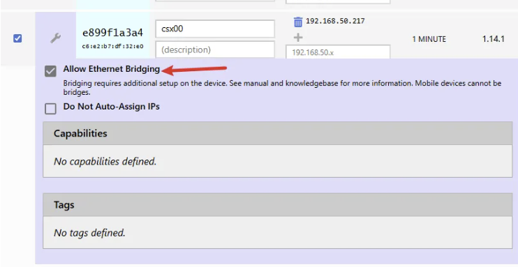
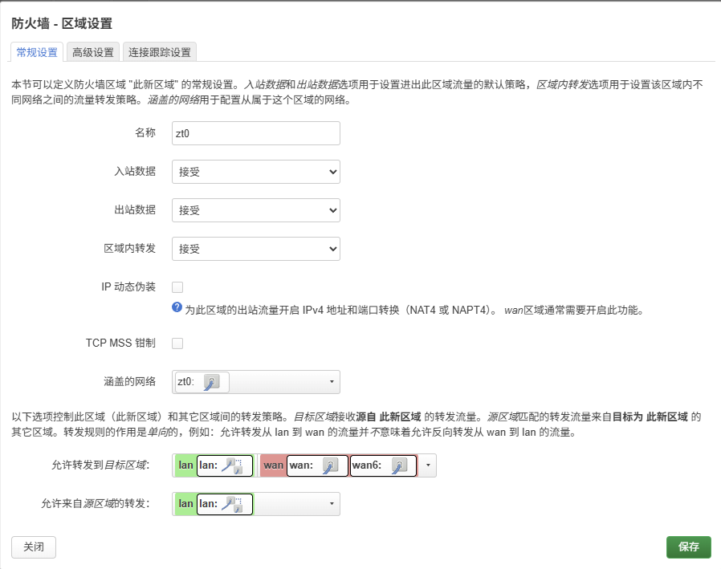
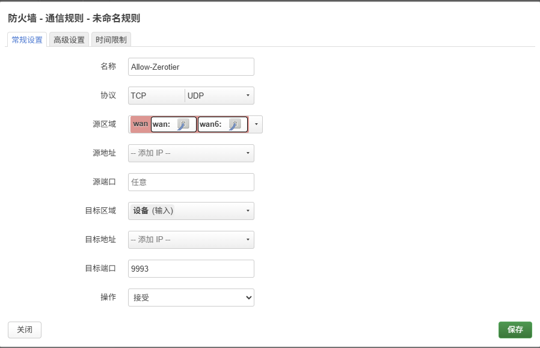
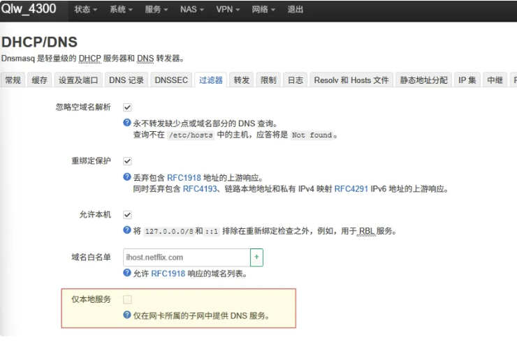

# Zerotier

## 配置

# 

::: tip

IP 动态伪装： 如果从 123.123.123.123(192.168.40.1):8888 -> 192.168.20.1:80 就需要开
:::

### 允许桥接



## 内网互通

### 新增接口


::: tip
这里配防火墙的时候才会显示
:::


### 防火墙



#### 防火墙规则-允许直连



## 命令

```shell
# 查看是否直连
zerotier-cli peers

```

## DNS 互联

异地子网已经打通，还剩下 DNS 的问题， 如有以下设备

```
A 子网有  xps -> 192.168.20.10
B 子网有  phone -> 192.168.30.10
```

期望无论在哪个子网，输入 phone 即可访问设备，因为 手机、笔记本等设备在不同子网 ip 是不同的

### 方案 1 中央 DNS 服务器

无论谁做 dns 服务器断连后风险都很大... 废弃

### 方案 2 异地查询

::: tip
输入 `phone` 的时候 dnsmasq 会自动添加 `.lan` 本地域名。
:::

如果不同子网约定不同的域名后缀，那么可以根据域名后缀将 dns 请求发给对应的子网网关解析，查询后返回 ip 即可，那么就可以做到自动发现，无需维护静态 DHCP。

::: danger
不同子网必须约定不同的本地域名，如果都使用相同的 `.lan` 会造成死循环。
:::

#### 允许非本地查询

```plain
uci set dhcp.@dnsmasq[0].localservice='0'  # 允许非本地查询
uci commit
service dnsmasq restart
```



#### lan 转发其他服务器

```tsx
uci add_list dhcp.@dnsmasq[0].server='/lan/192.168.30.1'  # 30网段OpenWrt的ZeroTier IP或LAN IP
uci commit
service dnsmasq restart
```


