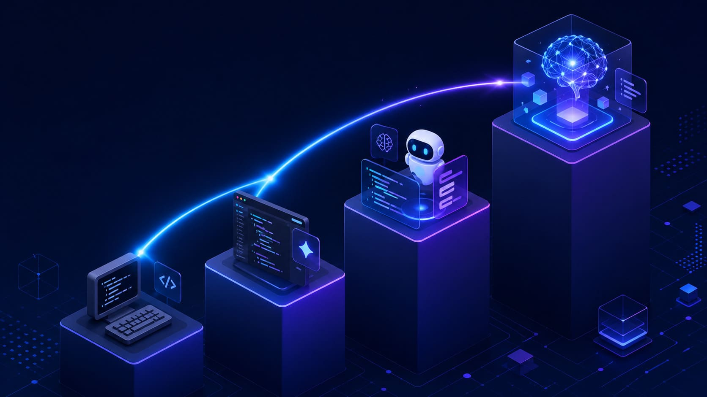
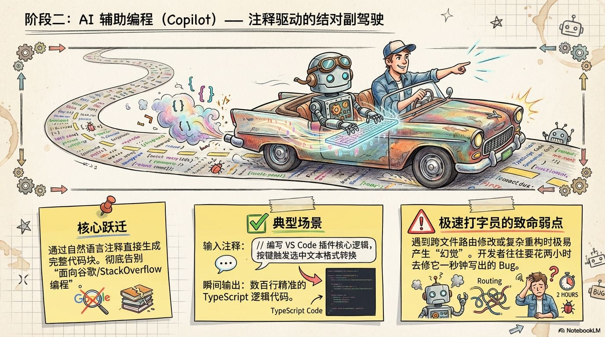
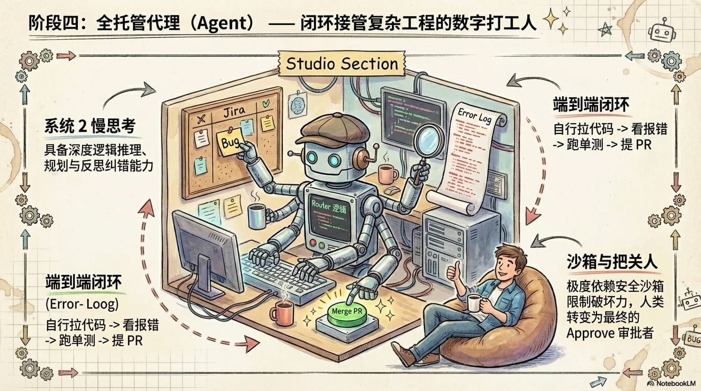
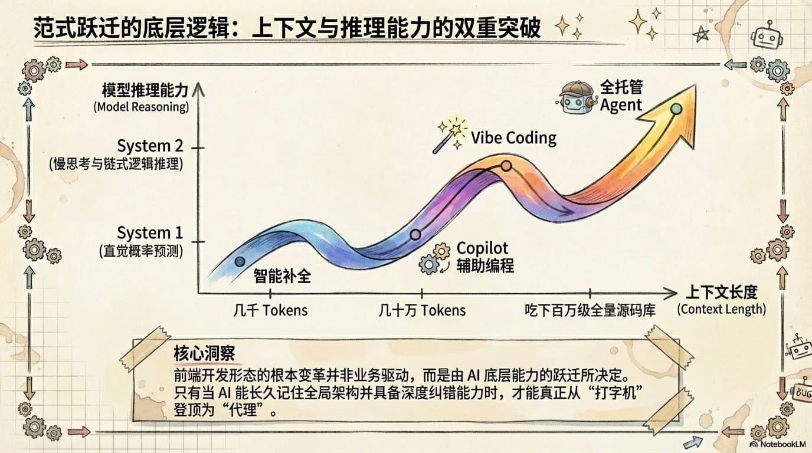
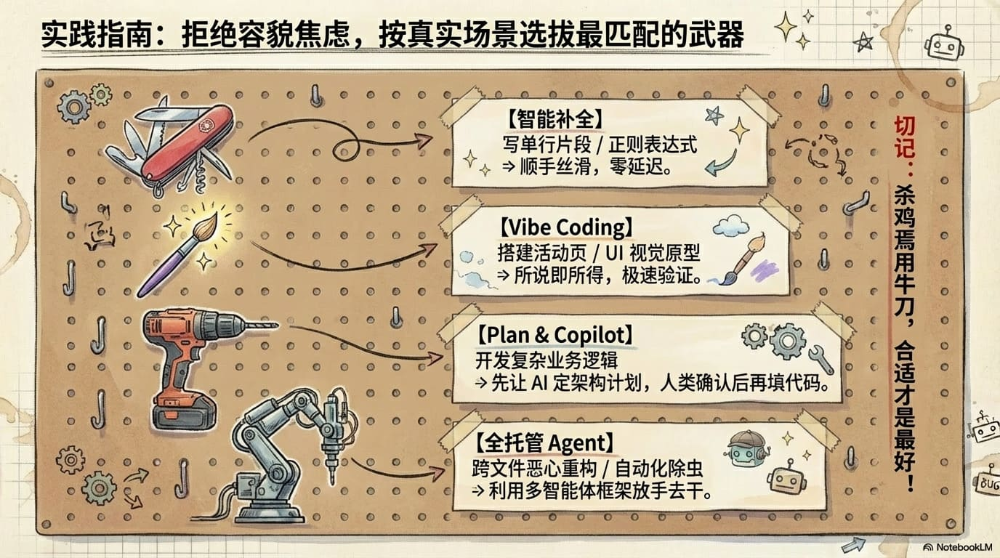
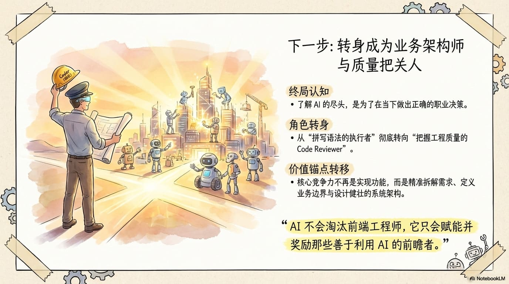

# 从智能补全到 Harness：AI 编程的四次跃迁



八年前，编辑器能做到最聪明的事是：你敲 `useS`，它帮你补出 `useState`。

今天，一句“给项目加登录页并跑通测试”扔给 Claude Code，它自己读现有路由、自己写组件、自己跑测试、自己修 lint，只在要执行破坏性命令时停下来等一次确认。

中间发生的不是简单的“工具变好了”。从 IntelliSense 到 Copilot，从 ChatGPT 到 Cursor，从 Claude Code 到 Devin —— 这十年里，“写代码”这件事本身被改写了四次。每一次都解决了上一次的瓶颈，又留下下一次要面对的新问题。

但拨开 Tab、@、Cmd+K、agent 模式这些表层的入口看，会发现这一切背后其实是同一件事在推动。后面一节一节走完，这件事自然会浮出来。

---

## 一、智能补全


故事的起点要倒回到 2010 年代到 2021 年这段时间。那时候 IDE 的“智能”还和大模型无关。VS Code 的 IntelliSense、JetBrains 的智能补全、早期的 Tabnine，做的事是基于符号表、静态分析，加上一点本地小模型（N-gram、统计 LM），根据当前作用域、变量类型、历史输入预测下一个 token。

再往前一代是纯文本匹配 —— 你打 `useS`，它列出文件里所有以 `useS` 开头的字符串，连字符串字面量都不放过。完全没有语义。智能补全这一代第一次把“懂语义”做出来：它知道你在写一个 React 组件、scope 里有哪些 hooks 在用、`onClick` 应该接什么签名。所以你敲 `useS` 它给你 `useState`，你敲 `function Login(` 它接上 `Props` 形参类型。

但它能“看到”的代码窗口只有几百个 token。看不到当前函数外面，更别说跨文件理解。它读不懂自然语言意图 —— 你写 `// 帮我做一个登录表单`，它毫无反应。它只能接龙，不能对话。

这一代下写一个登录表单，基本是从零手敲：

```tsx
function Login() {
  const [email, setEmail] =        // IDE 补出 useState<string>('')
  const [password, setPassword] =
  // handleSubmit、表单 JSX、校验、错误提示 —— 全部自己写
}
```

IDE 帮你接 token，思考的全部责任在你身上。

---

## 二、AI 辅助编程 (Copilot)



2021 年 Copilot 出现，这是 Transformer 大模型第一次真正意义上塞进编辑器。它基于 OpenAI 的 Codex，后面 Tabnine Pro、Codeium、Amazon CodeWhisperer 也陆续跟上。

变化有两层。一是模型能“看到”的代码窗口涨到了 2K–8K token，LLM 能看见光标周围加当前文件的大部分，甚至有一点点跨文件提示。二是产出的形态从“接 token”变成了“接意图块”—— 你写一行注释，它给你整个函数；你写个函数签名，它给你函数体。**注释 → 实现** 这条路径第一次成立。

体感上你按方向盘，AI 在边上递扳手。你写到一半停下，它帮你接完。模式是“人主导，AI 副驾”。

但 Copilot 仍然只接龙，不对话。你要先写代码的开头，它才知道接什么；你想跟它讨论“这个组件该不该拆”，它做不到；最关键的是，它能装进上下文的代码量太少 —— 一两个文件就到顶。跨文件改动（同时改 router 和组件文件）它无能为力。

写登录表单这件事变成：

```tsx
// 受控登录表单，邮箱密码校验，Tailwind 样式
function Login() {
    // ↑ Copilot 看到这行注释，一次补出整个组件骨架
    const [email, setEmail] = useState('');
    const [password, setPassword] = useState('');
    // ... validation、handleSubmit、JSX 全部由 Copilot 一次性补完
}
```

但 `Login` 组件之外的事 —— 注册路由、调 API、写测试 —— 还是你手动一项项接。AI 帮你写完了“组件文件”，但项目仍然是你拼起来的。

---

## 三、自然语言编程 (Vibe Coding)


2023 年起，ChatGPT、Claude Chat、Cursor 的 Compose 和 Chat、v0.dev、bolt.new、Replit Ghostwriter 把整件事推进了一大截。“Vibe coding”这个词来自 Andrej Karpathy 的一句调侃 —— 不再写代码，而是描述意图。

变化在两个维度同时发生。一是上下文窗口跃迁到 32K–200K，一次能塞进多个文件、甚至整个模块。Cursor 这类工具还内置了项目级文件索引，让“项目级理解”变成默认体验，你可以 `@` 一个文件、`@` 一个文件夹喂给它。二是交互形态变了 —— 从“接龙”变成“对话与生成”，改动以 diff 形式呈现，你预览后一键 apply 或拒绝。

体感上你从“驾驶员”变成了“产品经理”。你描述想要什么，AI 把代码生出来；你审 diff，决定是否合入。

写登录表单这件事变成在 Cursor 里 `Cmd+K` 输入：

```
加一个登录表单组件，放到 /pages/login.tsx,
接现有的 useAuth hook，使用项目里的 Button 和 Input,
失败时调用 useToast 显示错误。
```

AI 直接产出 diff：新建 `pages/login.tsx`、修改 `routes.tsx` 注册路由。你预览，apply。

但接下来要跑测试时它跑不了。`npm test` 报了一个 type 错误，你复制粘贴回去给它，它给你新 diff……再 apply、再跑、再贴。**你成了它的运行时**。模型能看见整个项目，但它只会“说”，不会“动手”。复杂任务被切成几十次「描述 → 生成 → apply → 跑命令 → 报错 → 描述」的循环。

更微妙的事情是：虽然窗口涨到 200K，但每次对话仍是单次输入。你切到下一个任务，它又是“新的开始”，没有持续的工作状态。

---

## 四、全托管 / Harness Agent



2024 年起，Claude Code、Devin、Aider、Cursor Agent 模式、OpenHands 这一批工具陆续登场。这一代真正的突破，是 AI 终于拿到了“动手能力”。它能自己读文件、自己跑 `npm test`、自己看测试输出、自己修 lint、自己 `git commit`，然后把结果观察一下，决定下一步怎么走 —— 一个“感知 → 决策 → 行动 → 观测”的闭环。

让这件事成立的，不是模型本身变聪明了多少，而是模型外面包的那层执行框架 —— **Harness**。

Harness 做的事可以拆成五件，每一件都不能少：

- **工具调用 (Tool Use)** —— 闭环的起点。模型说“我要 read 这个文件 / 跑这条命令”，Harness 真的去执行，再把结果喂回模型。
- **上下文管理 / Compaction** —— 解决长会话的问题。Harness 自动把已经过去的细节压缩成摘要，主线不丢、窗口不爆。
- **子代理 (Subagent)** —— 派出一个独立 context 的子任务（比如“把仓库里所有用 useAuth 的地方列出来”），主对话不会被这堆探索结果污染。
- **Skills / Hooks** —— 可插拔的领域知识（“这个项目用 Tailwind v4”）加上事件触发器（“commit 前自动跑 lint”、“任务完成时推送通知”），让 Harness 变成可定制的工作台。
- **权限系统** —— 破坏性操作必须用户批准，防止 agent 自己跑飞。这是 agent 能进入真实仓库的前提。

体感上你从“产品经理”变成“工程师 + AI 团队的协作者”。你下达任务、批关键决策、审最终 PR，中间执行环节交给 agent。

写登录表单变成在 Claude Code 里说一句：

```
给项目加一个登录表单页，接现有的 useAuth，跑通现有测试。
```

接下来 agent 自己执行：read 现有 router 看路由约定 → read `useAuth` 的签名 → read 已有的表单组件对齐风格 → write 新文件 → write 修改 router → run `npm test` → 报了个 type 错误 → 自己定位、修改、再跑 → 通过 → 给你看完整 diff。中间你只在执行破坏性命令时按一次确认。从“信使”变回了真正的“决策者”。

这一代当然还在演进 —— 复杂任务的可靠性、错误恢复、跨大代码库的真实理解都是工程难题。Token 成本也明显高于补全，一次完整的 agent 任务可能烧掉补全的两个数量级。Harness 设计本身仍在快速迭代，不同产品体感差距不小。

---

## 回头看，真正发生的是什么



如果把每一次跃迁的“局限”摆在一起看，会发现每一次被卡住的点都指向同一个东西 —— **能装进上下文里的代码量**。

智能补全卡在几百 token，所以看不见函数外。Copilot 涨到 2K–8K，但塞不下两个文件。Vibe Coding 涨到 32K–200K，塞得下整个模块，但单次输入就是它的上限。到了 Harness 时代，compaction 和 subagent 这些机制本质上不是在让上下文“更长”，而是在有限窗口里把任务状态**持续维持下去** —— 把上下文从一张快照变成了一张流动的工作台。

把这件事画成时间轴看得更清楚：

```
2018  ─────  几百 token        智能补全       看见一个函数
2021  ─────  2K–8K              Copilot        看见一两个文件
2023  ─────  32K–200K           Vibe Coding    看见一个模块
2024+ ─────  200K + compaction  Harness/Agent  在窗口里持续工作
```

四次跃迁其实不是四次孤立的发明，是上下文容量从“几行代码 → 一个文件 → 一个项目 → 一段持续的工作流”的四级阶梯。每一次跨越，都建立在上下文能力的临界点上。

这件事对选工具有很直接的指导意义：真正要看的不是“哪个模型最聪明”，而是 **它能装下多大的任务，以及能在窗口里维持多久**。

---

## 按场景选开发方式



铺到这，真正用起来的关键是：**别迷信最新最强的方式**。这四种方式不是“越新越好”，而是在不同复杂度的任务上各有所长。一个简单任务硬上 agent，反而慢、贵、还容易跑偏。

| 场景                                                   | 合适的方式        | 为什么                                                                                                         |
| ------------------------------------------------------ | ----------------- | -------------------------------------------------------------------------------------------------------------- |
| 写一行 `useState`、补一个 `for` 循环、改个变量名       | **智能补全**      | 你脑子里已经有完整答案，要的只是少敲几个键。这时候让 agent 先 read 文件再思考再 write，反而比按一下 Tab 慢十倍 |
| 一个清晰但模板化的函数（数据转换、表单校验、API 包装） | **AI 辅助编程**   | 你能用一行注释讲清要什么，接龙模式正合适；不需要跨文件理解，Copilot 出活就够                                   |
| 一个新组件、跨几个文件的小功能，你大概知道方案         | **自然语言编程**  | 需要描述意图 + 让 AI 跨文件对齐现有约定，但你能自己审 diff、自己跑测试                                         |
| 一整个任务从 0 到验收（写 + 跑 + 修 + 提 PR）          | **Harness Agent** | 多步任务、需要持续维持上下文、需要真实跑命令并根据结果迭代。这是 agent 的主场，也只有它能闭环                  |

这四种方式之间不是替代关系，是分工。一个合理的日常节奏大致是：大部分时间用智能补全 + Copilot 处理常规代码，做新功能时切到 Cursor 用自然语言描述意图，真要把一整块任务从头交出去时才动用 Claude Code 这一类 agent。**最贵的工具不一定最合适** —— 写一个 `useState` 调用 agent 是杀鸡用牛刀，而把“加一个登录页并跑通测试”丢给智能补全是缘木求鱼。

至于具体用哪家产品 —— Copilot 还是 Cursor，Claude Code 还是 Devin —— 那是另一个层次的选择，看团队习惯、看 IDE、看预算。但**先判断该用哪种方式，再挑产品**，这个顺序不能颠倒。

---

## 最后



回看这几次跃迁，开发者其实一直在被工具推着往后退 —— Copilot 把“接龙”变成习惯，Cursor 把“描述意图”变成习惯，Claude Code 又把“审 diff”变成习惯。每一次工具升级，人在协作里的角色都被动地往后退一格。

但这件事正在反转。Harness 时代之后，工具越聪明，接下来要往哪走、能往哪走，反而越是只能由人来决定。

再往下，有三条线大概率会成为主线：

- **从单 agent 走向 agent 团队** —— 前端、后端、测试、评审各司其职，由一个 main agent 负责调度。Claude Code 的 subagent 已经在做雏形，再往后只会更专业化。
- **持久记忆 (Persistent Memory)** —— 今天的 agent 每次都是从零认识你，代码风格、团队规范、过往决策它都记不住。下一代会带着记忆来，这会从根本上改变协作的样子。
- **Harness 自我演化** —— agent 开始修改自己的 hooks 和 skills，工具开始造自己的工具，这是工程师工具链的“递归”。

这三条线背后指向同一个判断：**写代码这件事的稀缺性，正在从“手快”转向“判断准”**。会指挥 agent 团队的人比写代码快的人更值钱。基础任务被 agent 接管之后，门槛不是降了，是抬了 —— 真正稀缺的是看清每个工具的能力边界、在 agent 跑偏时把它拉回来、判断哪些事值得交给它、哪些事必须自己做。

如果要把这几年的体会压成两句话，那大概是：

> 工具迭代得越快，「边界感」反而越值钱。
>
> 上下文是 AI 的视野，Harness 是 AI 的手，而你 —— 是它的方向。
