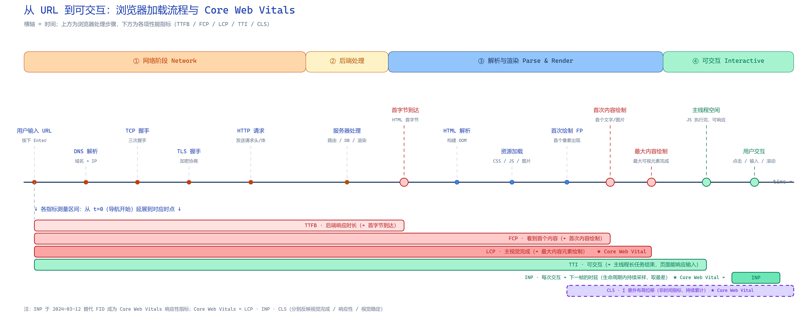

# B 端性能优化

## 网页指标

> [Web Vitals](https://web.dev/articles/vitals?hl=zh-cn)

前端网站优化的核心目标是 **更快的显示与更稳定的交互**，通过技术手段无限拉近与原生应用的体验差距。谷歌给出的核心指标（Core Web Vitals）主要有三个：

- **Largest Contentful Paint (LCP)**：衡量加载性能。为提供良好体验，应在页面首次开始加载的 **2.5 秒** 内完成 LCP。
- **Interaction to Next Paint (INP)**：衡量交互响应性。良好体验下，网页的 INP 应 **不超过 200 毫秒**。
- **Cumulative Layout Shift (CLS)**：衡量视觉稳定性。良好体验下，网页的 CLS 应 **保持在 0.1 或更低**。



对于微前端架构的重型 B 端平台而言，从用户敲下 `URL` 到可操作的链路中，真正可控的范围非常有限 —— 上下游 `CDN`、网关、基建均超出我们的边界， **能下手的是子应用的加载链路**，因此重点指标是压缩 `TTFB` 到 `LCP` 的时间。

## 通用优化

老生常谈的内容不再赘述， [雅虎军规](https://developer.yahoo.com/performance/rules.html) 仍具参考意义，但随着现代前端工程化的演进，不少条目的实际意义已经弱化：

- **最小化网络请求**，控制 HTTP 数量
    - HTTP/2 的多路复用已突破并发数限制，过去的泛域名分片方案逐渐退场
- **优化资源加载顺序**
    - CSS 在顶部、JS 在底部已是框架的默认配置
- **缓存与压缩**
    - 合理配置 `Expires` 或 `Cache-Control` 响应头，启用 `Gzip` / `Brotli` 压缩
- **引入 CDN**
- **其他**
    - 减少 DOM 元素数量
    - 使 Ajax 可缓存
    - 延迟加载组件
    - 避免重定向和 404 错误
    - ……

## 方法论

回到最朴素的公式： `时间 = 大小 / 速度`，由此可以拆出三条主线。

### 提高速度

**以空间换时间 —— Cache**

针对变动不频繁的资源（菜单、用户信息、权限列表等配置或计算信息）进行本地缓存，后续发生更新再替换。

**同步串行改异步并发**

- 代码支持更多空状态，增强鲁棒性。结合 Cache，子应用可以与主应用的依赖接口并发执行，从串行依赖改为并行的多状态流转。例如权限接口通常会阻塞子应用加载，但可以默认按无权限渲染，接口返回后再修正状态。
- 菜单、导航等均可拆分为异步子模块，减少主应用体积，提前子应用加载时机。
- `React.lazy` 拆分异步组件
- `Promise` / `Promise.all` 组织异步逻辑

**减少 React 渲染 / DOM 开销**

- 使用 [全局状态 + 状态下沉](https://www.yuque.com/hlwzn/hi5s1y/qknnb4gpf8tfaheh) 降低状态复杂度，避免无意义的顶层渲染。如 Layout：

```jsx
function Layout() {
    /** 此处不应写任何状态，否则会触发整棵子树重渲染 */
    return (
        <>
            <Auth /> {/* 通过全局状态仅让末级组件渲染 */}
            <Menu />
            <Nav />
            <Outlet />
        </>
    );
}
```

- `useMemo` / `useCallback` 不太想用 —— 除非真的命中性能瓶颈，优先通过组件拆分和状态下沉治本，避免无谓的心智负担。
- 使用 `requestAnimationFrame` 合并 DOM 操作、节流高频更新：

```js
function handleScroll() {
    // 将更新操作延迟到下一帧
    requestAnimationFrame(() => {
        const scrollTop = window.scrollY;
        document.body.style.backgroundColor = `rgba(255, 0, 0, ${scrollTop / 1000})`;
    });
}
window.addEventListener('scroll', handleScroll);
```

- 首屏非视口 `div` 占位，通过 `IntersectionObserver` 进入视口后再加载
- 长列表启用虚拟滚动（如 `react-window`、`rc-virtual-list`），避免万级节点一次性渲染
- 长任务切片： `scheduler.yield()` / `setTimeout` / `requestIdleCallback` 把阻塞主线程的 JS 任务切碎，直接改善 INP

**合并 & 缓存请求**

- [useQuery](https://tanstack.com/query/) 王炸 —— 统一托管请求去重、缓存、失效与重试

**SSR / SSG**

B 端平台大部分是实时动态数据，SSR 会进一步增加服务器负载，整体收益有限。仅建议对登录、概览等少量稳定页面做针对性尝试。

**静态资源 & CDN & DNS**

- 图片使用更高压缩率的 `WebP` / `AVIF`；减少字体种类，约束为三种（数字、特殊、正文）
- 按需加载： [IntersectionObserver + setTimeout](https://segmentfault.com/a/1190000046453750?utm_source=sf-similar-article) 懒加载图片，或直接使用原生 ``
- 静态资源统统上 CDN
- 资源预加载： `<link rel="preload" href="style.css" as="style" />`
- 提前建连： `<link rel="preconnect" href="//api.xx.com">`
- DNS 预解析： `<link rel="dns-prefetch" href="//xx.com">`
- 字体加载： `font-display: swap` 避免 FOIT（文字不可见延迟）
- 响应式图片加载

```html
<!-- 通过 picture 实现 -->
<picture>
    <source srcset="banner_w1000.jpg" media="(min-width: 801px)" />
    <source srcset="banner_w800.jpg" media="(max-width: 800px)" />
    
</picture>
```

```css
/* 通过 @media 实现 */
@media (min-width: 769px) {
    .bg {
        background-image: url(bg1080.jpg);
    }
}
@media (max-width: 768px) {
    .bg {
        background-image: url(bg768.jpg);
    }
}
```

**Node 版本**

新版 Node 一般都带来更好的构建性能。升级后对比构建产物一致，就可以平滑切换。

**合适的打包策略**

- 公共依赖一般不变，可提取为独立 chunk 做长期缓存
- 按路由 → 页面粒度打包，做到按需加载；使用组件路径命名 chunk，便于线上事故排查

### 减小大小

**构建产物分析**

推荐 [`rsdoctor`](https://rsdoctor.dev/)，基于 `webpack-bundle-analyzer` 封装，信息更全面，可以发现很多未使用却被打包进来的产物 —— 多半是 **tree shaking** 失效造成的。

**tree shaking**

- 尽量使用 **命名导入**。许多库因为默认导入被整体打包，如 `import _ from 'lodash'` 应改为 `import debounce from 'lodash/debounce'` 或直接使用 `lodash-es`
- 不要从 `antd/lib`（CJS）导入，改为 `antd/es`，才能被 tree shaking
- 循环依赖会破坏 tree shaking，可用 `npx madge --circular src/**/*` 排查
- 移除未使用的代码，如 `oneApi` 中未调用的请求定义

**精简与替换依赖**

- 许多库已经过时或其能力已被现代 JS 原生支持，可参考 [e18e](https://e18e.dev/docs/replacements/) 进行替换
- `Ant Design` 的 [Space](https://ant-design.antgroup.com/components/space-cn) 会增加 DOM 层级，使用 `Flex` + `gap` 即可实现同样的间距效果
- 使用 `npx depcheck` 检查未使用的依赖
- 调整依赖分类，如将 `@types/*` 移入 `devDependencies`，减少生产环境安装时间

**qiankun 3 依赖复用**

分析并提取各子应用的公共依赖统一打包，其他子应用加载时直接命中缓存，避免重复下载 React、Antd 等重型依赖。

### 减少感知时间

> 时间也可以被欺骗

- 大背景图先用相近颜色的 CSS 打底，视觉上几乎无感知差异
- 使用 [Skeleton 骨架屏](https://ant-design.antgroup.com/components/skeleton-cn) 占位
- SPA + 路由快照 ≈ 0s 切换
- 交互即时反馈：按钮点击立即置灰 / Loading，避免"卡顿"错觉
- 预热下一步路由与接口数据（ `<link rel="prefetch">` / 提前发起请求）

### 稳定布局（CLS）

- 为 `` / `<video>` 显式声明 `width`、`height` 或 `aspect-ratio`，避免资源加载后的布局跳动
- 为异步插入的广告位、提示条预留占位容器
- 字体回退使用 `size-adjust` / `ascent-override` 等描述符，避免切换字体导致文字宽度突变

## 监控与度量

优化不是一次性动作，需要持续量化：

- 使用 [`web-vitals`](https://github.com/GoogleChrome/web-vitals) 上报真实用户指标（RUM）
- 通过 `PerformanceObserver` 采集长任务、资源加载等明细数据
- 本地回归使用 Chrome DevTools 的 **Performance** 面板与 **Lighthouse**
