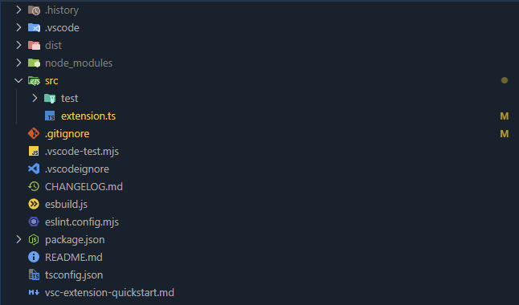
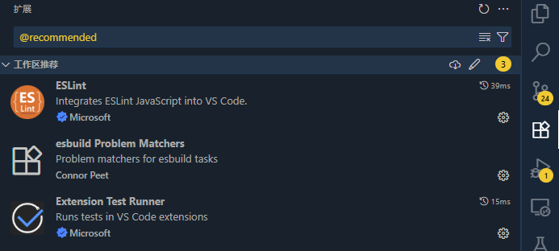
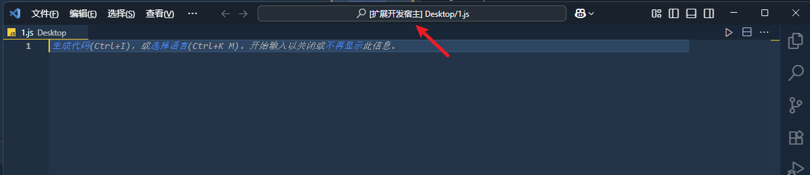
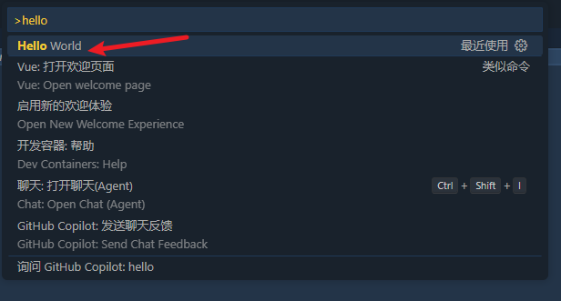
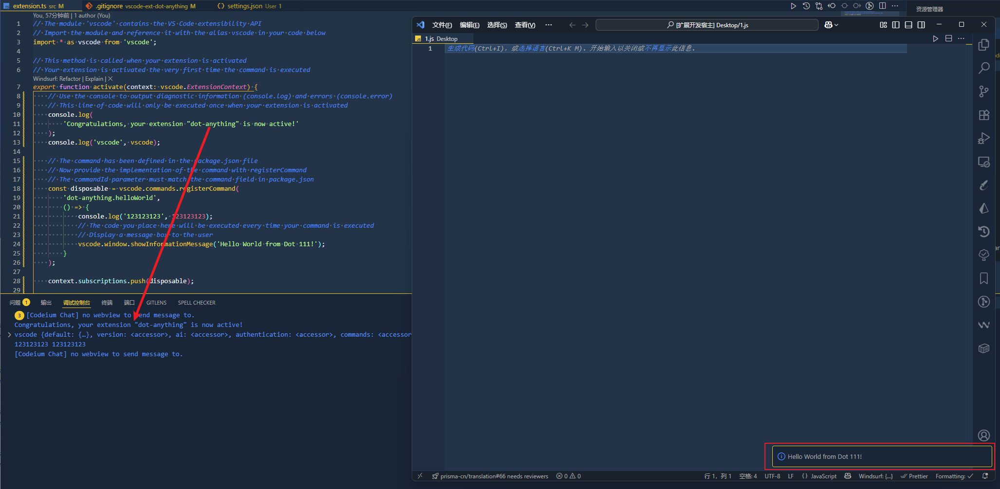
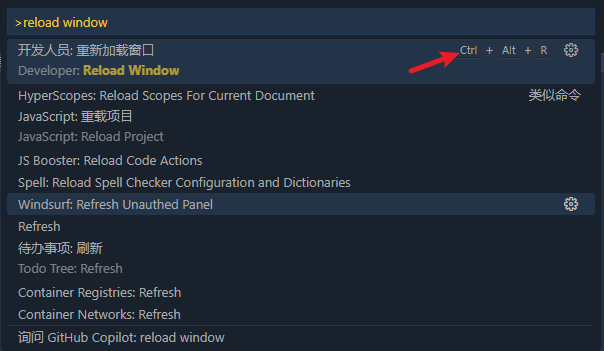
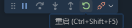
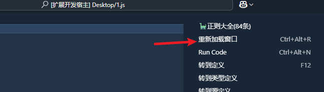
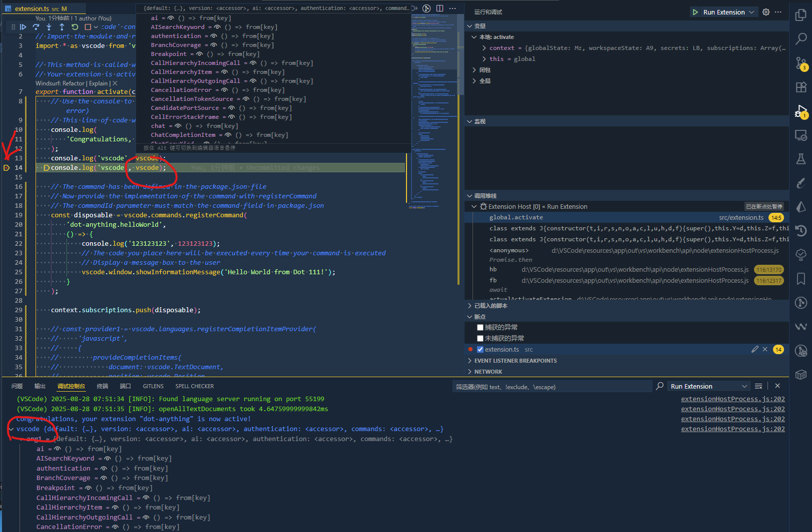

# HelloWorld

Vscode 官方提供了基于 [yeoman](https://github.com/yeoman/yeoman) 生态的脚手架 [vscode-generator-code](https://github.com/Microsoft/vscode-generator-code) 来生成项目结构，无需从 0 搭建。

## init

在当前目录执行 `npx --package yo --package generator-code -- yo code` 将会出现交互式命令，根据向导填写信息一步步选择即可

```bat
# ? What type of extension do you want to create? New Extension (TypeScript)
# ? What's the name of your extension? HelloWorld
### Press <Enter> to choose default for all options below ###

# ? What's the identifier of your extension? helloworld
# ? What's the description of your extension? LEAVE BLANK
# ? Initialize a git repository? Y
# ? Which bundler to use? unbundled
# ? Which package manager to use? npm

# ? Do you want to open the new folder with Visual Studio Code? Open with `code`

```

然后我们就得到了一个 `HelloWorld` 的初始化工程项目，其中 `src\extension.ts` 就是我们的入口文件，`.vscode` 中有一些预设文件。



## 环境配置

使用 `VsCode` 打开项目会发现在 `.vscode\extensions.json` 中推荐安装 `dbaeumer.vscode-eslint` `connor4312.esbuild-problem-matchers` `ms-vscode.extension-test-runner` 三个插件用于开发

也可以直接在插件 Tab 中搜索 @recommended 直接安装



## Run

项目在 `.vscode\launch.json` 中预设了启动器即命令，我们可以在入口文件 `src\extension.ts` 下直接按 `F5` 启动项目，此时会弹出一个新的 “预装” 了我们当前插件的 `VsCode` 窗口便于我们查看效果，Title 中会有 `扩展开发宿主` 字样。



> 为了方便描述，后续我们将编辑项目的 VsCode 称为 `代码窗`， 显示效果的 VsCode 称为 `结果窗`

在`结果窗`中通过 `Ctrl+Shift+P` 唤起命令面板，执行 `Hello World`



将会在 `结果窗` 的右下角看到 `Hello World` 字样的弹窗，以及在 `代码窗` 的控制台看到代码中 `console` 的输出。



## Reload

代码不是热重载的，修改完代码后需要在 `结果窗` 中执行 `Reload Window`, 或者按快捷键 `Ctrl + Alt + R` 手动重载

> 看到别人都是说 `Ctrl + R`，我的快捷键大概率是错的，经历 brackets -> Sublime -> Atom -> Vscode，我的快捷键已经自成一派了…… =.=!



或者在 `编辑窗` 中执行 `Ctrl + Shift +F5`



上述两种官方推荐都很蛋疼，建议在 `package.json` 中增加

```json
{
    ...
        "contributes": {
            ...
            "menus": {
                "editor/context": [
                    {
                        "when": "editorFocus",
                        "command": "workbench.action.reloadWindow",
                        "group": "navigation"
                    }
                ]
            }
        },
    ...
}
```

就可以在 `结果窗` 中得到一个右键快捷重载的命令，也可以将你需要 debug 的命令放进去。

当然最后在上线时需要移除，最讨厌在右键菜单中塞各种命令导致右键长的吓人……



## Debug

直接在 `编辑窗` 行号左侧点击添加断点即可，在控制台能看到输出，右侧面板能看到上下文，还有个小工具栏可以步进等，基本和 Chrome 开发工具类似。



此时我们已经具备 VsCode 插件的开发能力了。
